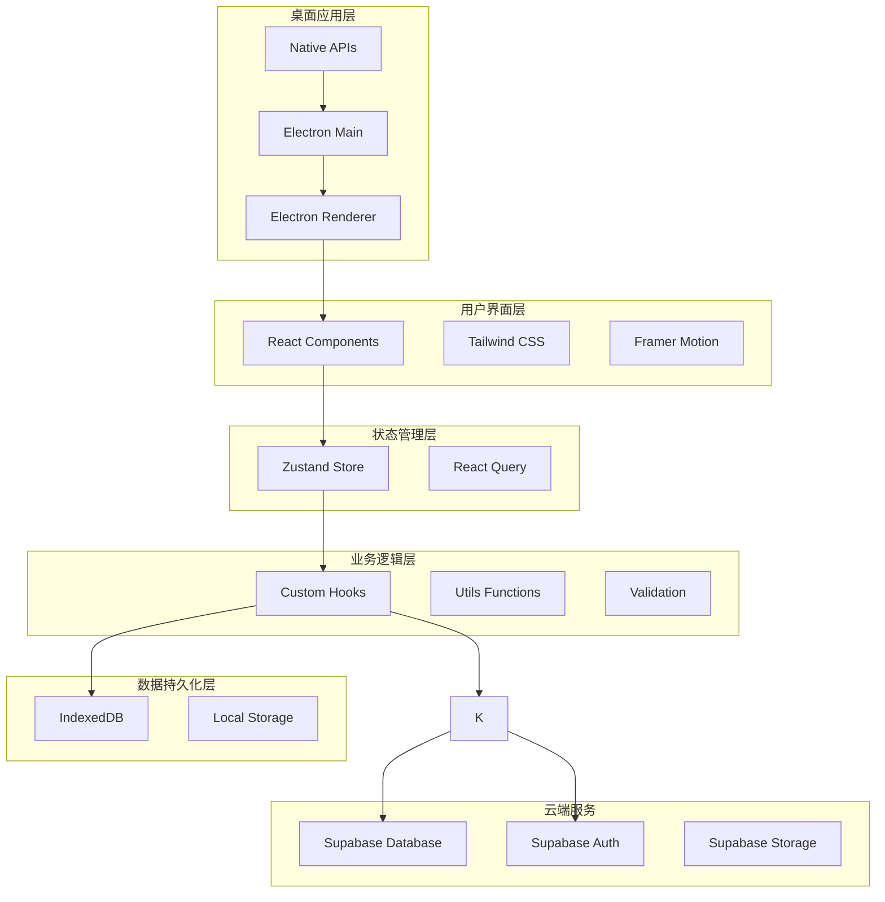
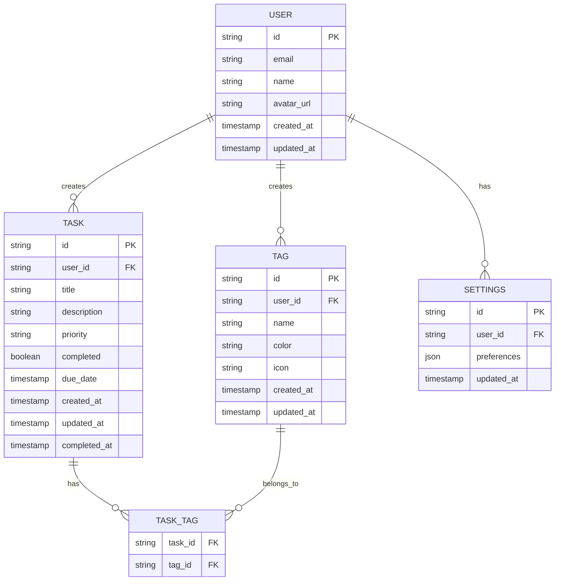

# 🏗️ 系统架构与技术说明

本文档详细描述了 DeskTODOList 项目的系统架构、技术选型和实现细节，帮助开发者快速理解项目结构。

## 📋 目录

- [系统架构概览](#系统架构概览)
- [技术栈详解](#技术栈详解)
- [项目结构](#项目结构)
- [数据模型](#数据模型)
- [API 设计](#api设计)
- [状态管理](#状态管理)
- [性能优化](#性能优化)
- [安全策略](#安全策略)

## 🎯 系统架构概览

### 整体架构图



### 架构分层说明

#### 1. 用户界面层 (Presentation Layer)

- **React Components**: 组件化的用户界面
- **Tailwind CSS**: 原子化 CSS 框架，快速构建样式
- **Framer Motion**: 流畅的动画和过渡效果

#### 2. 状态管理层 (State Management Layer)

- **Zustand Store**: 轻量级状态管理，管理应用全局状态
- **React Query**: 服务端状态管理，处理数据获取和缓存

#### 3. 业务逻辑层 (Business Logic Layer)

- **Custom Hooks**: 封装业务逻辑的自定义 Hook
- **Utils Functions**: 通用工具函数
- **Validation**: 数据验证逻辑

#### 4. 数据持久化层 (Data Persistence Layer)

- **IndexedDB**: 本地结构化数据存储
- **Local Storage**: 简单配置和偏好设置
- **Supabase Client**: 云端数据同步客户端

#### 5. 桌面应用层 (Desktop Application Layer)

- **Electron Main**: 主进程，管理应用生命周期
- **Electron Renderer**: 渲染进程，运行 Web 应用
- **Native APIs**: 系统原生功能集成

## 🛠️ 技术栈详解

### 前端技术栈

| 技术            | 版本  | 用途     | 选择理由                             |
| --------------- | ----- | -------- | ------------------------------------ |
| React           | 18.2+ | UI 框架  | 成熟的组件化开发，丰富的生态系统     |
| TypeScript      | 5.0+  | 类型系统 | 提供类型安全，提升开发效率和代码质量 |
| Vite            | 4.0+  | 构建工具 | 快速的开发服务器和构建速度           |
| Tailwind CSS    | 3.3+  | CSS 框架 | 原子化 CSS，快速构建响应式界面       |
| Framer Motion   | 10.0+ | 动画库   | 声明式动画，提升用户体验             |
| React Hook Form | 7.45+ | 表单管理 | 高性能的表单处理，减少重渲染         |
| Zod             | 3.22+ | 数据验证 | TypeScript 优先的数据验证库          |

### 状态管理

| 技术        | 版本  | 用途       | 选择理由                          |
| ----------- | ----- | ---------- | --------------------------------- |
| Zustand     | 4.4+  | 全局状态   | 轻量级，API 简洁，TypeScript 友好 |
| React Query | 4.0+  | 服务端状态 | 强大的数据获取和缓存能力          |
| Immer       | 10.0+ | 不可变数据 | 简化复杂状态更新逻辑              |

### 桌面应用

| 技术             | 版本  | 用途         | 选择理由                           |
| ---------------- | ----- | ------------ | ---------------------------------- |
| Electron         | 25.0+ | 桌面应用框架 | 跨平台，Web 技术栈，丰富的原生 API |
| Electron Builder | 24.0+ | 应用打包     | 支持多平台打包和自动更新           |

### 数据存储

| 技术      | 版本 | 用途           | 选择理由                              |
| --------- | ---- | -------------- | ------------------------------------- |
| IndexedDB | -    | 本地数据库     | 浏览器原生，支持复杂查询和事务        |
| Dexie.js  | 3.2+ | IndexedDB 封装 | 简化 IndexedDB 操作，提供 Promise API |

### 开发工具

| 技术       | 版本  | 用途         | 选择理由                       |
| ---------- | ----- | ------------ | ------------------------------ |
| ESLint     | 8.0+  | 代码检查     | 保证代码质量和一致性           |
| Prettier   | 3.0+  | 代码格式化   | 统一代码风格                   |
| Husky      | 8.0+  | Git Hooks    | 提交前代码检查                 |
| Commitlint | 17.0+ | 提交信息检查 | 规范提交信息格式               |
| Vitest     | 0.34+ | 单元测试     | 快速的测试运行器，与 Vite 集成 |
| Playwright | 1.37+ | E2E 测试     | 跨浏览器端到端测试             |

## 📁 项目结构

```
DeskTODOList/
├── public/                     # 静态资源
│   ├── icons/                 # 应用图标
│   └── locales/               # 国际化文件
├── src/
│   ├── components/            # React组件
│   │   ├── ui/               # 基础UI组件
│   │   │   ├── Button/
│   │   │   ├── Input/
│   │   │   ├── Modal/
│   │   │   └── index.ts
│   │   ├── features/         # 功能组件
│   │   │   ├── TaskList/
│   │   │   ├── TaskForm/
│   │   │   ├── TagManager/
│   │   │   └── Settings/
│   │   └── layout/           # 布局组件
│   │       ├── Header/
│   │       ├── Sidebar/
│   │       └── MainLayout/
│   ├── hooks/                # 自定义Hooks
│   │   ├── useTask.ts
│   │   ├── useTag.ts
│   │   ├── useLocalStorage.ts
│   │   └── useKeyboard.ts
│   ├── stores/               # 状态管理
│   │   ├── taskStore.ts
│   │   ├── tagStore.ts
│   │   ├── settingsStore.ts
│   │   └── authStore.ts
│   ├── services/             # 服务层
│   │   ├── api/
│   │   │   ├── tasks.ts
│   │   │   ├── tags.ts
│   │   │   └── auth.ts
│   │   ├── database/
│   │   │   ├── indexedDB.ts
│   │   │   └── supabase.ts
│   │   └── sync/
│   │       └── syncService.ts
│   ├── types/                # TypeScript类型定义
│   │   ├── task.ts
│   │   ├── tag.ts
│   │   ├── user.ts
│   │   └── api.ts
│   ├── utils/                # 工具函数
│   │   ├── date.ts
│   │   ├── validation.ts
│   │   ├── format.ts
│   │   └── constants.ts
│   ├── styles/               # 样式文件
│   │   ├── globals.css
│   │   ├── components.css
│   │   └── animations.css
│   ├── App.tsx              # 应用根组件
│   ├── main.tsx             # 应用入口
│   └── vite-env.d.ts        # Vite类型声明
├── electron/                 # Electron相关
│   ├── main.ts              # 主进程
│   ├── preload.ts           # 预加载脚本
│   └── utils/
├── tests/                    # 测试文件
│   ├── unit/                # 单元测试
│   ├── integration/         # 集成测试
│   └── e2e/                 # 端到端测试
├── docs/                     # 文档
├── scripts/                  # 构建脚本
└── config files             # 配置文件
```

## 🗄️ 数据模型

### 核心实体关系图



### TypeScript 类型定义

```typescript
// types/task.ts
export interface Task {
  id: string;
  userId: string;
  title: string;
  description?: string;
  priority: TaskPriority;
  completed: boolean;
  dueDate?: Date;
  createdAt: Date;
  updatedAt: Date;
  completedAt?: Date;
  tags: Tag[];
}

export enum TaskPriority {
  LOW = "low",
  NORMAL = "normal",
  HIGH = "high",
  URGENT = "urgent",
}

// types/tag.ts
export interface Tag {
  id: string;
  userId: string;
  name: string;
  color: string;
  icon?: string;
  createdAt: Date;
  updatedAt: Date;
}

// types/user.ts
export interface User {
  id: string;
  email: string;
  name: string;
  avatarUrl?: string;
  createdAt: Date;
  updatedAt: Date;
}

// types/settings.ts
export interface UserSettings {
  id: string;
  userId: string;
  preferences: {
    theme: "light" | "dark" | "system";
    language: string;
    notifications: {
      enabled: boolean;
      sound: boolean;
      desktop: boolean;
    };
    shortcuts: Record<string, string>;
    sync: {
      enabled: boolean;
      interval: number;
    };
  };
  updatedAt: Date;
}
```

## 🔌 API 设计

### RESTful API 规范

#### 任务管理 API

```typescript
// GET /api/tasks - 获取任务列表
interface GetTasksRequest {
  page?: number;
  limit?: number;
  priority?: TaskPriority;
  completed?: boolean;
  tagIds?: string[];
  search?: string;
  sortBy?: "createdAt" | "dueDate" | "priority";
  sortOrder?: "asc" | "desc";
}

interface GetTasksResponse {
  tasks: Task[];
  total: number;
  page: number;
  limit: number;
}

// POST /api/tasks - 创建任务
interface CreateTaskRequest {
  title: string;
  description?: string;
  priority: TaskPriority;
  dueDate?: string; // ISO 8601
  tagIds?: string[];
}

interface CreateTaskResponse {
  task: Task;
}

// PUT /api/tasks/:id - 更新任务
interface UpdateTaskRequest {
  title?: string;
  description?: string;
  priority?: TaskPriority;
  completed?: boolean;
  dueDate?: string;
  tagIds?: string[];
}

interface UpdateTaskResponse {
  task: Task;
}

// DELETE /api/tasks/:id - 删除任务
interface DeleteTaskResponse {
  success: boolean;
}
```

#### 标签管理 API

```typescript
// GET /api/tags - 获取标签列表
interface GetTagsResponse {
  tags: Tag[];
}

// POST /api/tags - 创建标签
interface CreateTagRequest {
  name: string;
  color: string;
  icon?: string;
}

interface CreateTagResponse {
  tag: Tag;
}

// PUT /api/tags/:id - 更新标签
interface UpdateTagRequest {
  name?: string;
  color?: string;
  icon?: string;
}

interface UpdateTagResponse {
  tag: Tag;
}

// DELETE /api/tags/:id - 删除标签
interface DeleteTagResponse {
  success: boolean;
}
```

#### 用户认证 API

```typescript
// POST /api/auth/login - 用户登录
interface LoginRequest {
  email: string;
  password: string;
}

interface LoginResponse {
  user: User;
  accessToken: string;
  refreshToken: string;
}

// POST /api/auth/register - 用户注册
interface RegisterRequest {
  email: string;
  password: string;
  name: string;
}

interface RegisterResponse {
  user: User;
  accessToken: string;
  refreshToken: string;
}

// POST /api/auth/refresh - 刷新令牌
interface RefreshTokenRequest {
  refreshToken: string;
}

interface RefreshTokenResponse {
  accessToken: string;
  refreshToken: string;
}
```

### API 客户端实现

```typescript
// services/api/client.ts
import { createClient } from "@supabase/supabase-js";

const supabaseUrl = import.meta.env.VITE_SUPABASE_URL;
const supabaseKey = import.meta.env.VITE_SUPABASE_ANON_KEY;

export const supabase = createClient(supabaseUrl, supabaseKey);

// services/api/tasks.ts
export class TaskAPI {
  static async getTasks(params: GetTasksRequest): Promise<GetTasksResponse> {
    let query = supabase
      .from("tasks")
      .select("*, tags(*)")
      .order(params.sortBy || "createdAt", {
        ascending: params.sortOrder === "asc",
      });

    if (params.completed !== undefined) {
      query = query.eq("completed", params.completed);
    }

    if (params.priority) {
      query = query.eq("priority", params.priority);
    }

    if (params.search) {
      query = query.ilike("title", `%${params.search}%`);
    }

    const { data, error, count } = await query.range(
      (params.page || 0) * (params.limit || 20),
      ((params.page || 0) + 1) * (params.limit || 20) - 1
    );

    if (error) throw error;

    return {
      tasks: data || [],
      total: count || 0,
      page: params.page || 0,
      limit: params.limit || 20,
    };
  }

  static async createTask(
    task: CreateTaskRequest
  ): Promise<CreateTaskResponse> {
    const { data, error } = await supabase
      .from("tasks")
      .insert(task)
      .select("*, tags(*)")
      .single();

    if (error) throw error;
    return { task: data };
  }

  static async updateTask(
    id: string,
    updates: UpdateTaskRequest
  ): Promise<UpdateTaskResponse> {
    const { data, error } = await supabase
      .from("tasks")
      .update(updates)
      .eq("id", id)
      .select("*, tags(*)")
      .single();

    if (error) throw error;
    return { task: data };
  }

  static async deleteTask(id: string): Promise<DeleteTaskResponse> {
    const { error } = await supabase.from("tasks").delete().eq("id", id);

    if (error) throw error;
    return { success: true };
  }
}
```

## 🏪 状态管理

### Zustand Store 设计

```typescript
// stores/taskStore.ts
import { create } from 'zustand';
import { devtools, persist } from 'zustand/middleware';
import { immer } from 'zustand/middleware/immer';

interface TaskState {
  tasks: Task[];
  selectedTask: Task | null;
  filters: TaskFilters;
  loading: boolean;
  error: string | null;
}

interface TaskActions {
  // 任务操作
  addTask: (task: Omit<Task, 'id' | 'createdAt' | 'updatedAt'>) => void;
  updateTask: (id: string, updates: Partial<Task>) => void;
  deleteTask: (id: string) => void;
  toggleTask: (id: string) => void;

  // 选择操作
  selectTask: (task: Task | null) => void;

  // 筛选操作
  setFilters: (filters: Partial<TaskFilters>) => void;
  clearFilters: () => void;

  // 异步操作
  fetchTasks: () => Promise<void>;
  syncTasks: () => Promise<void>;

  // 状态管理
  setLoading: (loading: boolean) => void;
  setError: (error: string | null) => void;
}

export const useTaskStore = create<TaskState & TaskActions>()()
  devtools(
    persist(
      immer((set, get) => ({
        // 初始状态
        tasks: [],
        selectedTask: null,
        filters: {
          completed: undefined,
          priority: undefined,
          tagIds: [],
          search: ''
        },
        loading: false,
        error: null,

        // 任务操作
        addTask: (taskData) => {
          set((state) => {
            const newTask: Task = {
              ...taskData,
              id: generateId(),
              createdAt: new Date(),
              updatedAt: new Date()
            };
            state.tasks.push(newTask);
          });
        },

        updateTask: (id, updates) => {
          set((state) => {
            const index = state.tasks.findIndex(task => task.id === id);
            if (index !== -1) {
              state.tasks[index] = {
                ...state.tasks[index],
                ...updates,
                updatedAt: new Date()
              };
            }
          });
        },

        deleteTask: (id) => {
          set((state) => {
            state.tasks = state.tasks.filter(task => task.id !== id);
            if (state.selectedTask?.id === id) {
              state.selectedTask = null;
            }
          });
        },

        toggleTask: (id) => {
          set((state) => {
            const task = state.tasks.find(task => task.id === id);
            if (task) {
              task.completed = !task.completed;
              task.completedAt = task.completed ? new Date() : undefined;
              task.updatedAt = new Date();
            }
          });
        },

        // 选择操作
        selectTask: (task) => {
          set((state) => {
            state.selectedTask = task;
          });
        },

        // 筛选操作
        setFilters: (newFilters) => {
          set((state) => {
            state.filters = { ...state.filters, ...newFilters };
          });
        },

        clearFilters: () => {
          set((state) => {
            state.filters = {
              completed: undefined,
              priority: undefined,
              tagIds: [],
              search: ''
            };
          });
        },

        // 异步操作
        fetchTasks: async () => {
          set((state) => {
            state.loading = true;
            state.error = null;
          });

          try {
            const response = await TaskAPI.getTasks(get().filters);
            set((state) => {
              state.tasks = response.tasks;
              state.loading = false;
            });
          } catch (error) {
            set((state) => {
              state.error = error.message;
              state.loading = false;
            });
          }
        },

        syncTasks: async () => {
          // 实现数据同步逻辑
        },

        // 状态管理
        setLoading: (loading) => {
          set((state) => {
            state.loading = loading;
          });
        },

        setError: (error) => {
          set((state) => {
            state.error = error;
          });
        }
      })),
      {
        name: 'task-store',
        partialize: (state) => ({
          tasks: state.tasks,
          filters: state.filters
        })
      }
    ),
    { name: 'TaskStore' }
  )
);
```

## ⚡ 性能优化

### 1. 组件优化

```typescript
// 使用 React.memo 优化组件渲染
export const TaskItem = React.memo<TaskItemProps>(({ task, onToggle }) => {
  // 使用 useCallback 优化事件处理函数
  const handleToggle = useCallback(() => {
    onToggle(task.id);
  }, [task.id, onToggle]);

  return <div className="task-item">{/* 组件内容 */}</div>;
});

// 使用 useMemo 优化计算密集型操作
const TaskList: React.FC<TaskListProps> = ({ tasks, filters }) => {
  const filteredTasks = useMemo(() => {
    return tasks.filter((task) => {
      if (
        filters.completed !== undefined &&
        task.completed !== filters.completed
      ) {
        return false;
      }
      if (filters.priority && task.priority !== filters.priority) {
        return false;
      }
      if (
        filters.search &&
        !task.title.toLowerCase().includes(filters.search.toLowerCase())
      ) {
        return false;
      }
      return true;
    });
  }, [tasks, filters]);

  return (
    <div className="task-list">
      {filteredTasks.map((task) => (
        <TaskItem key={task.id} task={task} />
      ))}
    </div>
  );
};
```

### 2. 虚拟滚动

```typescript
// 使用 react-window 实现虚拟滚动
import { FixedSizeList as List } from "react-window";

const VirtualTaskList: React.FC<{ tasks: Task[] }> = ({ tasks }) => {
  const Row = ({
    index,
    style,
  }: {
    index: number;
    style: React.CSSProperties;
  }) => (
    <div style={style}>
      <TaskItem task={tasks[index]} />
    </div>
  );

  return (
    <List height={600} itemCount={tasks.length} itemSize={80} width="100%">
      {Row}
    </List>
  );
};
```

### 3. 数据缓存

```typescript
// 使用 React Query 实现数据缓存
import { useQuery, useMutation, useQueryClient } from "@tanstack/react-query";

export const useTasks = (filters: TaskFilters) => {
  return useQuery({
    queryKey: ["tasks", filters],
    queryFn: () => TaskAPI.getTasks(filters),
    staleTime: 5 * 60 * 1000, // 5分钟
    cacheTime: 10 * 60 * 1000, // 10分钟
  });
};

export const useCreateTask = () => {
  const queryClient = useQueryClient();

  return useMutation({
    mutationFn: TaskAPI.createTask,
    onSuccess: () => {
      queryClient.invalidateQueries(["tasks"]);
    },
  });
};
```

### 4. 代码分割

```typescript
// 路由级别的代码分割
im;
```
