# 🗂️ DeskTODOList

> 一款轻量级、简约优雅的桌面待办事项管理应用

[](https://opensource.org/licenses/MIT)
[](#)
[](#)
[](#contributing)

## 📖 项目简介

DeskTODOList 是一款专为提升个人效率而设计的桌面待办事项管理应用。采用苹果式简约设计理念，提供"打开即用"的流畅体验，让任务管理变得简单而优雅。

### 🎯 解决的痛点
- ❌ 传统待办应用功能复杂，学习成本高
- ❌ 界面设计过于繁琐，影响专注力
- ❌ 缺乏有效的任务分类和优先级管理
- ❌ 跨设备同步体验不佳

## ✨ 核心功能

### 🎨 简约设计
- 遵循苹果设计语言，界面简洁优雅
- 支持浅色/深色主题切换
- 流畅的动画效果和微交互

### 📝 任务管理
- **快速添加**: 支持快捷键快速创建任务
- **智能分类**: 基于标签的灵活分类系统
- **优先级管理**: 四级优先级（紧急、重要、普通、低优先级）
- **进度跟踪**: 可视化任务完成进度

### 🏷️ 标签系统
- 自定义标签颜色和图标
- 支持多标签组合筛选
- 智能标签推荐

### ⏰ 时间管理
- 截止日期提醒
- 番茄钟集成
- 时间统计分析

### 🔄 数据同步
- 本地数据存储
- 云端备份（可选）
- 导入/导出功能

## 🚀 快速开始

### 环境要求
- Node.js >= 16.0.0
- npm >= 8.0.0 或 yarn >= 1.22.0

### 安装运行

```bash
# 克隆项目
git clone https://github.com/your-username/DeskTODOList.git
cd DeskTODOList

# 安装依赖
npm install
# 或
yarn install

# 启动开发服务器
npm run dev
# 或
yarn dev

# 构建生产版本
npm run build
# 或
yarn build

# 打包桌面应用
npm run electron:build
# 或
yarn electron:build
```

### 代码示例

```typescript
// 创建新任务
const newTask = {
  id: generateId(),
  title: '完成项目文档',
  description: '编写README和API文档',
  priority: 'high',
  tags: ['工作', '文档'],
  dueDate: '2024-01-15',
  completed: false
};

// 添加任务到状态管理
const { addTask } = useTaskStore();
addTask(newTask);
```

## 🏗️ 技术架构

```mermaid
graph TD
    A[用户界面 - React 18] --> B[状态管理 - Zustand]
    B --> C[本地存储 - IndexedDB]
    B --> D[云端同步 - Supabase]
    A --> E[桌面框架 - Electron]
    E --> F[系统集成]
    
    subgraph "前端技术栈"
        A
        B
    end
    
    subgraph "数据层"
        C
        D
    end
    
    subgraph "桌面应用"
        E
        F
    end
```



### 技术栈
- **前端**: React 18 + TypeScript + Tailwind CSS
- **状态管理**: Zustand
- **桌面框架**: Electron
- **数据库**: IndexedDB (本地) + Supabase (云端)
- **构建工具**: Vite
- **代码质量**: ESLint + Prettier + Husky

## 🤝 如何贡献

我们欢迎所有形式的贡献！请查看 [贡献指南](CONTRIBUTING.md) 了解详细信息。

### 快速贡献流程
1. Fork 本仓库
2. 创建功能分支 (`git checkout -b feature/AmazingFeature`)
3. 提交更改 (`git commit -m 'Add some AmazingFeature'`)
4. 推送到分支 (`git push origin feature/AmazingFeature`)
5. 创建 Pull Request

### 贡献类型
- 🐛 Bug 修复
- ✨ 新功能开发
- 📚 文档改进
- 🎨 UI/UX 优化
- ⚡ 性能优化
- 🧪 测试用例

## 📋 项目状态

- ✅ 核心任务管理功能
- ✅ 标签系统
- ✅ 本地数据存储
- 🚧 云端同步功能
- 🚧 移动端适配
- 📅 插件系统 (计划中)

查看完整的 [开发路线图](ROADMAP.md)

## 📄 许可证

本项目采用 [MIT 许可证](LICENSE) - 查看 LICENSE 文件了解详情。

## 🙏 致谢

感谢所有为这个项目做出贡献的开发者们！

## 📞 联系我们

- 📧 Email: your-email@example.com
- 🐛 Issues: [GitHub Issues](https://github.com/your-username/DeskTODOList/issues)
- 💬 Discussions: [GitHub Discussions](https://github.com/your-username/DeskTODOList/discussions)

---

⭐ 如果这个项目对你有帮助，请给我们一个 Star！