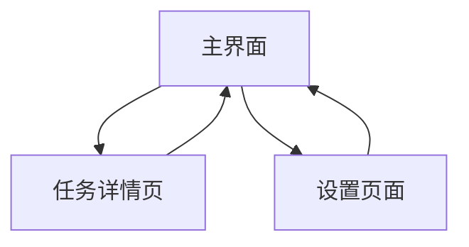

# 桌面 TODOList 应用产品需求文档

## 1. 产品概述

一款轻量级桌面 TODOList 应用，专注于任务管理的核心功能，采用苹果设计理念打造简约大气的用户界面。

- 解决用户日常任务管理需求，提供快速、直观的任务记录和跟踪体验，帮助用户提高工作效率和生活规划能力。
- 目标市场：追求简洁高效工作流程的个人用户，特别是习惯苹果生态系统设计风格的用户群体。

### 1.1 产品定位与价值主张

- **核心价值**：打开即用，专注任务管理本质，避免功能冗余
- **差异化优势**：苹果设计语言 + 轻量级架构 + 本地优先策略
- **目标用户画像**：个人效率工具用户，重视设计美感和使用体验

### 1.2 MVP 与迭代边界

**MVP 版本（必须实现）**：

- 任务的创建/编辑/完成/删除
- 本地数据持久化存储
- 快速添加任务功能
- 基本状态筛选（待办/已完成）
- 主题设置（浅色/深色/系统）
- 导出 CSV 功能
- 最小窗口尺寸支持和响应式布局
- 基础快捷键支持

**第 1 次迭代（重要功能）**：

- 本地系统通知提醒
- 任务排序（手动拖拽/按日期/按优先级）
- 搜索与复杂筛选功能
- 撤销（undo）操作
- CSV 数据导入功能
- 完整的快捷键体系

**未来迭代（可选功能）**：

- 云同步与多端支持
- 日历集成
- 自然语言解析（"明天上午 9 点开会"）
- 任务模板与重复任务
- 深度第三方集成（Siri/快捷方式）
- 协作功能

## 2. 核心功能

### 2.1 用户角色

本应用采用单用户模式，无需复杂的用户角色区分：

| 角色     | 使用方式     | 核心权限                                   |
| -------- | ------------ | ------------------------------------------ |
| 默认用户 | 直接启动应用 | 可创建、编辑、删除、完成任务，管理任务分类 |

### 2.2 数据模型定义

**任务数据结构**：

```typescript
interface Task {
  id: string; // UUID格式的唯一标识
  title: string; // 任务标题（必填，最大200字符）
  description: string; // 任务描述（可选，最大1000字符）
  priority: "low" | "medium" | "high"; // 优先级
  due_date: string | null; // 截止日期（ISO8601格式）
  created_at: string; // 创建时间（ISO8601格式）
  updated_at: string; // 更新时间（ISO8601格式）
  completed_at: string | null; // 完成时间（ISO8601格式）
  notes: Note[]; // 备注列表
  order_index: number; // 排序索引
  tags: string[]; // 标签列表（可选）
}

interface Note {
  id: string;
  content: string;
  created_at: string;
}
```

### 2.3 功能模块

我们的桌面 TODOList 应用包含以下核心页面：

1. **主界面**：任务列表展示、快速添加任务、任务状态切换
2. **任务详情页**：任务详细信息编辑、备注管理、优先级设置
3. **设置页面**：应用偏好设置、主题切换、数据管理

### 2.4 页面详情

| 页面名称   | 模块名称 | 功能描述                                                                |
| ---------- | -------- | ----------------------------------------------------------------------- |
| 主界面     | 任务列表 | 展示所有任务，支持按状态筛选（待办/已完成），任务项显示标题、优先级标识 |
| 主界面     | 快速添加 | 顶部输入框，支持回车快速创建任务，自动聚焦提升输入效率                  |
| 主界面     | 任务操作 | 点击完成任务，长按显示更多操作（编辑/删除），拖拽排序                   |
| 任务详情页 | 任务编辑 | 修改任务标题、添加详细描述、设置截止日期、选择优先级                    |
| 任务详情页 | 备注管理 | 添加和编辑任务备注，支持多行文本输入                                    |
| 设置页面   | 偏好设置 | 选择主题色彩、设置默认优先级、配置通知提醒                              |
| 设置页面   | 数据管理 | 导出任务数据、清空已完成任务、应用重置选项                              |

### 2.5 用户故事与验收标准

#### 2.5.1 任务创建功能

**用户故事 1**：作为用户，我希望通过键盘回车快速创建任务以提高录入效率。
**验收准则**：

- 在主界面聚焦输入框时，按回车创建任务并自动清空输入
- 新任务立即出现在列表顶部
- 创建延迟 <200ms
- 空输入时不创建任务，显示提示信息

**用户故事 2**：作为用户，我希望能够快速设置新任务的优先级。
**验收准则**：

- 创建任务时可选择优先级（低/中/高）
- 默认优先级为"中"
- 优先级用不同颜色的圆点标识
- 高优先级任务在列表中优先显示

#### 2.5.2 任务编辑功能

**用户故事 3**：作为用户，我希望双击任务能够快速进入编辑模式。
**验收准则**：

- 双击任务项打开任务详情页
- 编辑页面显示所有任务信息
- 保存时检查 updated_at 字段更新
- 取消编辑时恢复原始内容

**用户故事 4**：作为用户，我希望能够为任务添加详细描述和截止日期。
**验收准则**：

- 描述字段支持多行文本输入（最大 1000 字符）
- 日期选择器采用原生样式
- 截止日期可以清空（设为 null）
- 过期任务有视觉提示

#### 2.5.3 任务完成与删除

**用户故事 5**：作为用户，我希望任务被标为完成后能被快速恢复（undo）。
**验收准则**：

- 完成任务后 5 秒内显示"撤销"浮层
- 点击撤销可恢复任务状态
- 已完成任务在"已完成"列表中可见
- 支持批量清空已完成任务

**用户故事 6**：作为用户，我希望删除任务时有确认机制避免误操作。
**验收准则**：

- 长按或右键显示删除选项
- 删除前弹出确认对话框
- 确认对话框可在设置中配置为关闭
- 删除操作支持撤销（5 秒内）

#### 2.5.4 数据导入导出

**用户故事 7**：作为用户，我希望能够导出任务数据进行备份。
**验收准则**：

- 导出 CSV 格式，包含所有字段
- 导出文件能被 Excel 正确打开
- 导出进度有可视化反馈
- 导出失败时显示明确错误信息

**用户故事 8**：作为用户，我希望能够导入之前的任务数据。
**验收准则**：

- 支持 CSV 格式导入
- 导入前预览数据格式
- 重复任务处理策略（跳过/覆盖/重命名）
- 导入失败时提供详细错误报告

#### 2.5.5 快捷键支持

**用户故事 9**：作为用户，我希望通过快捷键提高操作效率。
**验收准则**：

- Ctrl/Cmd + N：快速新建任务并聚焦输入框
- Enter：在输入框内创建任务
- Space：切换选中任务的完成状态
- Delete：删除选中任务（弹出确认）
- Ctrl/Cmd + F：打开搜索功能
- Ctrl/Cmd + Z：撤销上一步操作
- 快捷键在设置页面可查看和自定义

## 3. 核心流程

**主要用户操作流程：**

用户启动应用后直接进入主界面，可以立即查看现有任务或通过顶部输入框快速添加新任务。点击任务项可以标记完成状态，长按任务可以进入编辑模式或删除任务。需要详细编辑任务时，双击任务进入任务详情页面，可以添加描述、设置优先级和截止日期。通过右上角设置按钮可以访问应用设置，调整主题和偏好配置。



## 4. 用户界面设计

### 4.1 设计风格

- **主色调**：#007AFF（苹果蓝）作为主色，#F2F2F7（浅灰）作为背景色
- **按钮样式**：圆角矩形按钮，采用苹果风格的轻微阴影和渐变效果
- **字体**：San Francisco 字体系列，标题使用 18px，正文使用 16px，辅助文字使用 14px
- **布局风格**：卡片式设计，顶部导航栏，充足的留白空间，遵循苹果 Human Interface Guidelines
- **图标风格**：使用 SF Symbols 风格的线性图标，简洁明了

### 4.2 页面设计概览

| 页面名称   | 模块名称 | UI 元素                                                                                     |
| ---------- | -------- | ------------------------------------------------------------------------------------------- |
| 主界面     | 任务列表 | 白色卡片背景，左侧圆形复选框，右侧任务文字，优先级用彩色圆点标识，完成任务显示删除线效果    |
| 主界面     | 快速添加 | 顶部固定输入框，占位符文字"添加新任务..."，右侧添加按钮，输入时显示蓝色边框                 |
| 任务详情页 | 任务编辑 | 全屏模态窗口，顶部导航栏带取消/保存按钮，表单字段使用圆角输入框，日期选择器采用苹果原生样式 |
| 设置页面   | 偏好设置 | 分组列表样式，每个设置项使用表格行布局，右侧显示当前值或开关控件                            |

### 4.3 交互细节与微动效

**微交互设计**：

- 完成任务：删除线动画（200ms）+ 渐隐效果，而非瞬间消失
- 拖拽排序：显示占位符，被拖动卡片微微放大（1.05 倍）提高感知
- 任务创建：新任务从顶部滑入动画（300ms 缓动）
- 按钮反馈：点击时轻微缩放（0.95 倍，100ms）
- 加载状态：骨架屏或优雅的加载动画

**文本处理**：

- 长任务标题：2 行截断 + "..." + 展开按钮
- 避免卡片高度不稳定，保持列表视觉一致性
- 支持文本选择和复制

**主题切换**：

- 三档选择：浅色/深色/跟随系统
- 品牌主色可配置（保留#007AFF 为默认）
- 切换时平滑过渡动画（300ms）

### 4.4 错误处理与空态设计

**空态处理**：

- 无任务时：显示欢迎文案"开始添加您的第一个任务"+ 示例任务建议
- 搜索无结果："未找到匹配的任务，尝试其他关键词"
- 已完成任务为空："还没有完成的任务，继续加油！"

**错误处理**：

- 磁盘写入失败："保存失败，请检查磁盘空间或权限"
- 导出失败："导出失败：[具体原因]，请重试或联系支持"
- 导入格式错误："文件格式不正确，请选择有效的 CSV 文件"
- 网络错误（未来同步功能）："网络连接失败，数据已保存到本地"

**用户反馈**：

- 操作成功：轻量级 Toast 提示（3 秒自动消失）
- 操作失败：明确的错误信息 + 建议的解决方案
- 长时间操作：进度条或加载指示器

### 4.5 响应式设计

应用采用桌面优先设计，针对 1024px 以上屏幕优化，支持窗口大小调整，最小窗口尺寸为 800x600px，确保在不同尺寸显示器上都有良好的使用体验。

## 5. 可访问性与国际化

### 5.1 可访问性要求

**键盘导航**：

- 支持 Tab 键在所有交互元素间导航
- 明确的焦点指示器（蓝色边框，2px）
- 支持 Enter 和 Space 键激活按钮
- Escape 键关闭模态窗口

**屏幕阅读器支持**：

- 所有交互元素有适当的 aria-label
- 任务状态变化有语音反馈
- 列表项目有清晰的层级结构
- 表单字段有关联的标签

**视觉辅助**：

- 支持高对比度主题
- 最小字体大小 14px，确保可读性
- 颜色信息不作为唯一的信息传达方式
- 支持系统字体大小设置

### 5.2 国际化支持

**多语言架构**：

- 文本外部化，使用 i18n 框架
- 初期支持：简体中文、繁体中文、英文
- 日期时间格式本地化
- 数字格式本地化

**文本处理**：

- 支持 RTL 语言预留（未来扩展）
- 动态文本长度适配
- 字体回退机制

## 6. 技术规范与性能要求

### 6.1 性能目标

**启动性能**：

- 冷启动时间 <1 秒
- 热启动时间 <300ms
- 首屏渲染时间 <500ms

**运行性能**：

- 1000 条任务无卡顿操作
- 内存占用 <200MB（1000 条任务）
- CPU 占用 <5%（空闲状态）
- 任务操作响应时间 <100ms

**数据处理**：

- 本地数据库查询 <50ms
- 导出 1000 条任务 <3 秒
- 导入 1000 条任务 <5 秒

### 6.2 兼容性要求

**系统要求**：

- Windows 10 及以上版本
- macOS 10.14 及以上版本
- 最小内存：4GB RAM
- 最小存储：100MB 可用空间

**技术栈**：

- 前端：React 18 + TypeScript
- 桌面框架：Electron 或 Tauri
- 数据存储：SQLite 或 IndexedDB
- 构建工具：Vite

### 6.3 数据安全与隐私

**本地存储**：

- 数据存储位置：用户文档目录/TodoApp
- 敏感数据加密存储（AES-256）
- 定期自动备份（可配置）

**隐私保护**：

- 默认不收集用户数据
- 遥测数据收集需用户明确同意
- 提供完全离线模式
- 数据导出时不包含系统信息

## 7. 产品指标与可观测性

### 7.1 关键产品指标（KPI）

**用户活跃度**：

- DAU（日活跃用户）
- MAU（月活跃用户）
- 用户留存率（1 日、7 日、30 日）
- 平均会话时长

**功能使用情况**：

- 任务创建数/日/用户
- 任务完成率（完成任务数/创建任务数）
- 任务平均完成时长
- 功能使用频率（搜索、筛选、导出等）

**产品质量指标**：

- 应用崩溃率 <0.1%
- 启动成功率 >99.9%
- 数据丢失率 <0.01%
- 用户反馈评分 >4.5/5.0

### 7.2 事件埋点规范

**核心事件定义**：

```typescript
// 任务操作事件
interface TaskEvent {
  event_name:
    | "task_created"
    | "task_completed"
    | "task_deleted"
    | "task_edited";
  task_id: string;
  priority: "low" | "medium" | "high";
  has_due_date: boolean;
  creation_method: "quick_add" | "detail_form";
  timestamp: string;
}

// 应用使用事件
interface AppEvent {
  event_name: "app_launched" | "feature_used" | "export_data" | "import_data";
  feature_name?: string;
  export_format?: "csv" | "json";
  session_duration?: number;
  timestamp: string;
}
```

**数据收集原则**：

- 用户明确同意后才收集
- 不收集个人敏感信息
- 数据本地化处理优先
- 提供数据删除选项

## 8. 风险识别与缓解策略

### 8.1 技术风险

**风险 1：性能在大量任务下降级**

- 影响：用户体验下降，可能导致用户流失
- 缓解策略：
  - 实现虚拟列表渲染
  - 任务分页加载
  - 建立性能基准测试
  - 定期性能监控

**风险 2：数据丢失或损坏**

- 影响：用户数据永久丢失，严重影响信任度
- 缓解策略：
  - 实现自动备份机制
  - 数据完整性校验
  - 多重备份策略
  - 数据恢复工具

### 8.2 产品风险

**风险 3：功能复杂化导致简洁性丧失**

- 影响：偏离产品核心价值，用户体验变差
- 缓解策略：
  - 严格区分"基础/进阶"功能
  - 进阶功能在设置中折叠
  - 定期用户体验评估
  - 功能使用数据分析

**风险 4：竞品压力与差异化不足**

- 影响：市场竞争力下降
- 缓解策略：
  - 专注苹果设计语言差异化
  - 持续用户反馈收集
  - 快速迭代响应市场
  - 建立用户社区

### 8.3 运营风险

**风险 5：用户获取成本过高**

- 影响：产品推广困难
- 缓解策略：
  - 口碑营销策略
  - 应用商店优化（ASO）
  - 社交媒体推广
  - 免费试用策略

## 9. 产品路线图

### 9.1 三个月快速迭代计划

**第 0-2 周：需求细化与设计**

- 完成详细 PRD 文档（本文档）
- UI/UX 低保真原型设计
- 技术架构设计确定
- 数据模型最终确认
- 开发环境搭建

**第 2-6 周：MVP 开发**

- 核心任务管理功能（创建/编辑/完成/删除）
- 本地数据持久化
- 基础 UI 界面实现
- 快速添加功能
- 基本筛选功能
- 主题设置
- 导出 CSV 功能
- 基础快捷键支持

**第 6-10 周：功能增强**

- 本地系统通知提醒
- 任务排序功能（手动/日期/优先级）
- 搜索与复杂筛选
- 撤销（undo）操作
- CSV 导入功能
- 完整快捷键体系
- 错误处理优化
- 空态文案完善

**第 10-12 周：测试与发布准备**

- 用户测试（5-10 名目标用户）
- 性能调优与 bug 修复
- 可访问性测试
- 安装包制作与分发
- 用户文档编写
- 监控埋点实施

### 9.2 后续迭代规划

**第 4-6 个月：增强功能**

- 云同步基础架构
- 任务标签系统
- 高级搜索功能
- 数据统计面板
- 多语言支持

**第 6-12 个月：生态扩展**

- 移动端应用
- 日历集成
- 第三方服务集成
- API 开放平台
- 插件系统

## 10. 验收清单

### 10.1 MVP 验收标准

**功能验收**：

- [ ] 任务创建：输入框聚焦，输入回车 → 新任务出现且焦点返回输入框
- [ ] 任务编辑：双击/右键编辑，修改保存，检查 updated_at 变更
- [ ] 任务完成：点击复选框，任务状态切换，显示删除线动画
- [ ] 任务删除：长按/右键删除，提示二次确认（可配置）
- [ ] 数据导出：导出 CSV，字段齐全且能被 Excel 导入
- [ ] 撤销操作：完成后 5 秒内点击撤销恢复
- [ ] 快捷键：所有定义的快捷键正常工作
- [ ] 主题切换：浅色/深色/系统三种模式正常切换

**性能验收**：

- [ ] 冷启动时间 <1 秒
- [ ] 热启动时间 <300ms
- [ ] 任务操作响应时间 <100ms
- [ ] 1000 条任务无明显卡顿

**兼容性验收**：

- [ ] Windows 10/11 正常运行
- [ ] macOS 10.14+正常运行
- [ ] 最小窗口尺寸 800x600px 正常显示
- [ ] 高 DPI 屏幕显示正常

### 10.2 质量保证

**代码质量**：

- [ ] 单元测试覆盖率 >80%
- [ ] 集成测试通过
- [ ] 代码审查完成
- [ ] 性能测试通过

**用户体验**：

- [ ] 可用性测试通过
- [ ] 可访问性测试通过
- [ ] 多语言测试通过（如适用）
- [ ] 错误处理测试通过

---

**文档版本**：v1.0  
**最后更新**：2024 年 1 月  
**负责人**：产品团队  
**审核状态**：待审核
