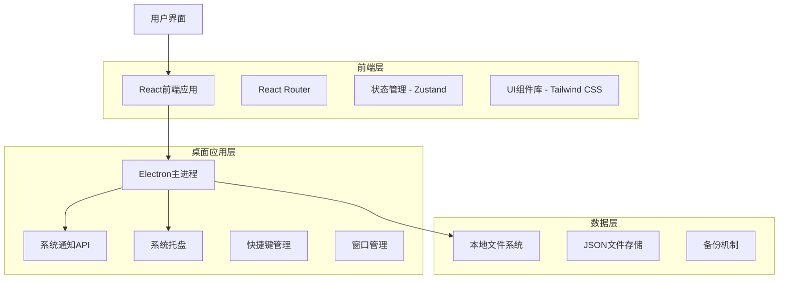
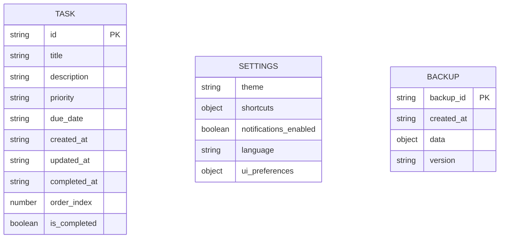
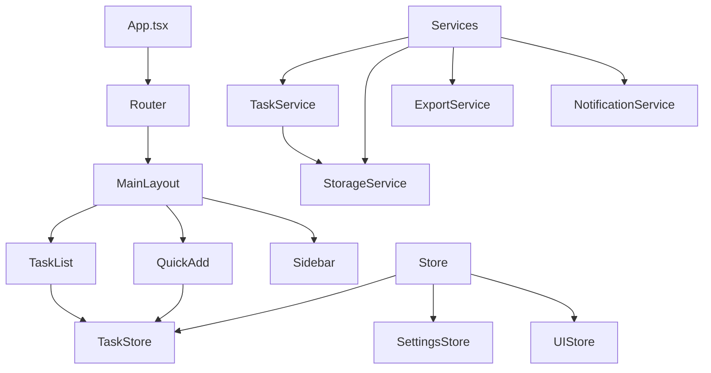
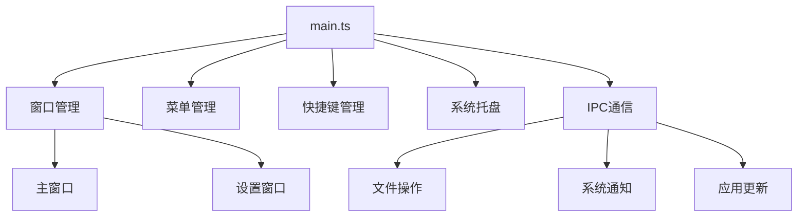

# 桌面TODOList应用技术架构文档

## 1. 架构设计



## 2. 技术描述

- **前端**: React@18 + TypeScript + Tailwind CSS + Vite
- **桌面框架**: Electron@latest
- **状态管理**: Zustand
- **路由**: React Router@6
- **UI组件**: Headless UI + 自定义组件
- **图标**: Lucide React
- **数据存储**: 本地JSON文件
- **构建工具**: Vite + Electron Builder

## 3. 路由定义

| 路由 | 用途 |
|------|------|
| / | 主页面，显示任务列表和快速添加 |
| /settings | 设置页面，主题、快捷键、导入导出配置 |
| /search | 搜索页面，高级搜索和筛选功能 |
| /stats | 统计页面，任务完成情况分析（后期功能） |

## 4. 数据模型

### 4.1 数据模型定义



### 4.2 数据定义语言

**任务数据结构 (Task)**
```typescript
interface Task {
  id: string; // UUID v4
  title: string; // 任务标题，最大200字符
  description?: string; // 任务描述，最大1000字符
  priority: 'low' | 'medium' | 'high'; // 优先级
  due_date?: string; // ISO8601格式日期
  created_at: string; // ISO8601格式时间戳
  updated_at: string; // ISO8601格式时间戳
  completed_at?: string; // ISO8601格式时间戳
  order_index: number; // 排序索引
  is_completed: boolean; // 完成状态
}
```

**应用设置 (Settings)**
```typescript
interface AppSettings {
  theme: 'light' | 'dark' | 'system'; // 主题设置
  shortcuts: {
    [key: string]: string; // 快捷键映射
  };
  notifications_enabled: boolean; // 通知开关
  language: 'zh-CN' | 'zh-TW' | 'en-US'; // 语言设置
  ui_preferences: {
    window_size: { width: number; height: number };
    window_position: { x: number; y: number };
    sidebar_collapsed: boolean;
    task_view_mode: 'list' | 'card';
  };
  auto_backup: boolean; // 自动备份开关
  backup_interval: number; // 备份间隔（小时）
}
```

**数据文件结构**
```typescript
interface AppData {
  version: string; // 数据版本号
  tasks: Task[];
  settings: AppSettings;
  metadata: {
    last_backup: string;
    total_tasks_created: number;
    app_install_date: string;
  };
}
```

**初始化数据**
```json
{
  "version": "1.0.0",
  "tasks": [],
  "settings": {
    "theme": "system",
    "shortcuts": {
      "new_task": "CmdOrCtrl+N",
      "search": "CmdOrCtrl+F",
      "toggle_complete": "Space",
      "delete_task": "Delete",
      "undo": "CmdOrCtrl+Z"
    },
    "notifications_enabled": true,
    "language": "zh-CN",
    "ui_preferences": {
      "window_size": { "width": 1000, "height": 700 },
      "window_position": { "x": -1, "y": -1 },
      "sidebar_collapsed": false,
      "task_view_mode": "list"
    },
    "auto_backup": true,
    "backup_interval": 24
  },
  "metadata": {
    "last_backup": "",
    "total_tasks_created": 0,
    "app_install_date": ""
  }
}
```

## 5. 核心模块架构

### 5.1 前端架构



### 5.2 Electron主进程架构



## 6. 关键技术实现

### 6.1 数据持久化

**存储位置**：
- Windows: `%APPDATA%/DeskTodoList/data.json`
- macOS: `~/Library/Application Support/DeskTodoList/data.json`
- Linux: `~/.config/DeskTodoList/data.json`

**备份策略**：
- 自动备份：每24小时创建备份文件
- 手动备份：用户主动导出
- 备份保留：最多保留30个自动备份文件
- 备份命名：`backup_YYYY-MM-DD_HH-mm-ss.json`

### 6.2 状态管理

```typescript
// 使用Zustand进行状态管理
interface TaskStore {
  tasks: Task[];
  filter: TaskFilter;
  searchQuery: string;
  
  // Actions
  addTask: (task: Omit<Task, 'id' | 'created_at' | 'updated_at'>) => void;
  updateTask: (id: string, updates: Partial<Task>) => void;
  deleteTask: (id: string) => void;
  toggleComplete: (id: string) => void;
  reorderTasks: (startIndex: number, endIndex: number) => void;
  setFilter: (filter: TaskFilter) => void;
  setSearchQuery: (query: string) => void;
}
```

### 6.3 快捷键系统

```typescript
// 快捷键配置
const shortcuts = {
  'CmdOrCtrl+N': () => openQuickAdd(),
  'CmdOrCtrl+F': () => focusSearch(),
  'Space': () => toggleSelectedTask(),
  'Delete': () => deleteSelectedTask(),
  'CmdOrCtrl+Z': () => undoLastAction(),
  'CmdOrCtrl+Shift+E': () => exportTasks(),
  'CmdOrCtrl+,': () => openSettings(),
  'Escape': () => clearSelection()
};
```

### 6.4 性能优化

**虚拟列表**：
- 使用react-window处理大量任务
- 每次渲染最多50个任务项
- 动态高度计算

**防抖处理**：
- 搜索输入防抖300ms
- 自动保存防抖1000ms
- 窗口大小调整防抖200ms

**内存管理**：
- 任务列表分页加载
- 图片资源懒加载
- 组件按需加载

## 7. 安全与隐私

### 7.1 数据安全

**本地加密**：
- 敏感数据使用AES-256加密
- 密钥存储在系统密钥链
- 支持用户设置主密码

**数据完整性**：
- 文件写入前校验JSON格式
- 定期数据完整性检查
- 损坏数据自动恢复机制

### 7.2 隐私保护

**数据收集**：
- 默认不收集任何用户数据
- 可选的匿名使用统计
- 用户明确同意后才启用

**网络通信**：
- 完全离线工作
- 无第三方数据传输
- 更新检查可关闭

## 8. 部署与分发

### 8.1 构建配置

```json
{
  "build": {
    "appId": "com.company.desktodolist",
    "productName": "DeskTodoList",
    "directories": {
      "output": "dist"
    },
    "files": [
      "dist-electron",
      "dist"
    ],
    "mac": {
      "category": "public.app-category.productivity",
      "target": "dmg"
    },
    "win": {
      "target": "nsis"
    },
    "linux": {
      "target": "AppImage"
    }
  }
}
```

### 8.2 系统要求

**最低要求**：
- Windows 10 (64-bit)
- macOS 10.14 Mojave
- Ubuntu 18.04 LTS
- 内存：4GB RAM
- 存储：100MB可用空间

**推荐配置**：
- Windows 11
- macOS 12 Monterey
- Ubuntu 20.04 LTS
- 内存：8GB RAM
- 存储：500MB可用空间

## 9. 开发工具链

### 9.1 开发环境

```json
{
  "scripts": {
    "dev": "vite",
    "build": "tsc && vite build",
    "electron:dev": "electron .",
    "electron:build": "electron-builder",
    "test": "vitest",
    "lint": "eslint . --ext ts,tsx",
    "format": "prettier --write ."
  }
}
```

### 9.2 代码质量

**静态分析**：
- ESLint + TypeScript规则
- Prettier代码格式化
- Husky Git钩子
- Commitlint提交规范

**测试策略**：
- 单元测试：Vitest + Testing Library
- E2E测试：Playwright
- 覆盖率目标：>80%

## 10. 监控与维护

### 10.1 错误监控

```typescript
// 错误收集（可选，需用户同意）
interface ErrorReport {
  error_id: string;
  timestamp: string;
  error_type: 'crash' | 'exception' | 'performance';
  error_message: string;
  stack_trace?: string;
  user_agent: string;
  app_version: string;
}
```

### 10.2 性能监控

**关键指标**：
- 应用启动时间
- 内存使用情况
- CPU使用率
- 任务操作响应时间
- 文件I/O性能

---

**文档版本**：v1.0  
**最后更新**：2024年1月  
**负责人**：技术团队  
**审核状态**：待审核