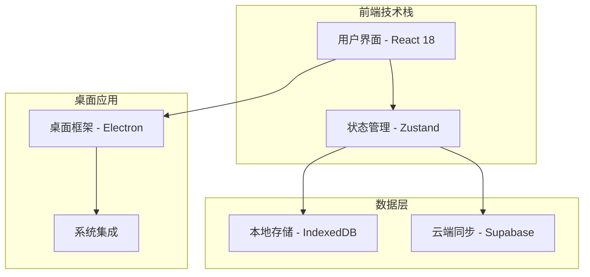

# 🗂️ DeskTODOList

> 一款轻量级、简约优雅的桌面待办事项管理应用

[](https://opensource.org/licenses/MIT)
[](#)
[](#)
[](#contributing)

## 📖 项目简介

DeskTODOList 是一款专为提升个人效率而设计的桌面待办事项管理应用。采用苹果式简约设计理念，提供"打开即用"的流畅体验，让任务管理变得简单而优雅。

### 🎯 解决的痛点
- ❌ 传统待办应用功能复杂，学习成本高
- ❌ 界面设计过于繁琐，影响专注力
- ❌ 缺乏有效的任务分类和优先级管理
- ❌ 跨设备同步体验不佳

## 📚 文档导航

为了帮助您更好地了解和使用 DeskTODOList，我们提供了完整的文档体系：

- 📖 [用户指南](USER_GUIDE.md) - 详细的功能使用说明和操作指南
- 🏗️ [系统架构](ARCHITECTURE.md) - 技术架构设计和API文档
- 🤝 [贡献指南](CONTRIBUTING.md) - 如何参与项目开发和贡献代码
- 🗺️ [开发路线图](ROADMAP.md) - 项目发展规划和未来愿景
- ❓ [常见问题](FAQ.md) - 常见问题解答和故障排除
- 📝 [更新日志](CHANGELOG.md) - 版本更新记录和功能变更
- 🐛 [问题模板](ISSUE_TEMPLATES.md) - Bug报告和功能请求模板

## ✨ 核心功能

### 🎨 简约设计
- 遵循苹果设计语言，界面简洁优雅
- 支持浅色/深色主题切换
- 流畅的动画效果和微交互

### 📝 任务管理
- **快速添加**: 支持快捷键快速创建任务
- **智能分类**: 基于标签的灵活分类系统
- **优先级管理**: 四级优先级（紧急、重要、普通、低优先级）
- **进度跟踪**: 可视化任务完成进度

### 🏷️ 标签系统
- 自定义标签颜色和图标
- 支持多标签组合筛选
- 智能标签推荐

### ⏰ 时间管理
- 截止日期提醒
- 番茄钟集成
- 时间统计分析

### 🔄 数据同步
- 本地数据存储
- 云端备份（可选）
- 导入/导出功能

## 🚀 快速开始

> 📖 **详细指南**：如需更详细的安装和使用说明，请参考 [用户指南](USER_GUIDE.md)。

### 环境要求
- Node.js >= 16.0.0
- npm >= 8.0.0 或 yarn >= 1.22.0

### 安装运行

```bash
# 克隆项目
git clone https://github.com/your-username/DeskTODOList.git
cd DeskTODOList

# 安装依赖
npm install
# 或
yarn install

# 启动开发服务器
npm run dev
# 或
yarn dev

# 构建生产版本
npm run build
# 或
yarn build

# 打包桌面应用
npm run electron:build
# 或
yarn electron:build
```

### 代码示例

```typescript
// 创建新任务
const newTask = {
  id: generateId(),
  title: '完成项目文档',
  description: '编写README和API文档',
  priority: 'high',
  tags: ['工作', '文档'],
  dueDate: '2024-01-15',
  completed: false
};

// 添加任务到状态管理
const { addTask } = useTaskStore();
addTask(newTask);
```

## 🏗️ 技术架构



### 技术栈
- **前端**: React 18 + TypeScript + Tailwind CSS
- **状态管理**: Zustand
- **桌面框架**: Electron
- **数据库**: IndexedDB (本地) + Supabase (云端)
- **构建工具**: Vite
- **代码质量**: ESLint + Prettier + Husky

> 🏗️ **深入了解**：查看 [系统架构文档](ARCHITECTURE.md) 了解详细的技术架构设计、数据模型和API规范。

## 🤝 如何贡献

我们欢迎所有形式的贡献！请查看 [贡献指南](CONTRIBUTING.md) 了解详细的开发流程、代码规范和提交要求。

### 快速贡献流程
1. Fork 本仓库
2. 创建功能分支 (`git checkout -b feature/AmazingFeature`)
3. 提交更改 (`git commit -m 'Add some AmazingFeature'`)
4. 推送到分支 (`git push origin feature/AmazingFeature`)
5. 创建 Pull Request

### 贡献类型
- 🐛 Bug 修复
- ✨ 新功能开发
- 📚 文档改进
- 🎨 UI/UX 优化
- ⚡ 性能优化
- 🧪 测试用例

## 📋 项目状态

- ✅ 核心任务管理功能
- ✅ 标签系统
- ✅ 本地数据存储
- 🚧 云端同步功能
- 🚧 移动端适配
- 📅 插件系统 (计划中)

> 🗺️ **了解更多**：查看完整的 [开发路线图](ROADMAP.md) 了解项目的发展规划和各阶段目标。
> 
> 📖 **使用帮助**：如需了解如何使用现有功能，请参考 [用户指南](USER_GUIDE.md)。

## 📄 许可证

本项目采用 [MIT 许可证](LICENSE) - 查看 LICENSE 文件了解详情。

## 🙏 致谢

感谢所有为这个项目做出贡献的开发者们！

> 📝 **版本历史**：查看 [更新日志](CHANGELOG.md) 了解每个版本的详细更新内容和贡献者信息。

## 📞 联系我们

- 📧 Email: your-email@example.com
- 🐛 Issues: [GitHub Issues](https://github.com/your-username/DeskTODOList/issues)
- 💬 Discussions: [GitHub Discussions](https://github.com/your-username/DeskTODOList/discussions)

> ❓ **遇到问题？**：在联系我们之前，请先查看 [常见问题](FAQ.md) 或使用 [问题模板](ISSUE_TEMPLATES.md) 提交详细的问题报告。

---

⭐ 如果这个项目对你有帮助，请给我们一个 Star！