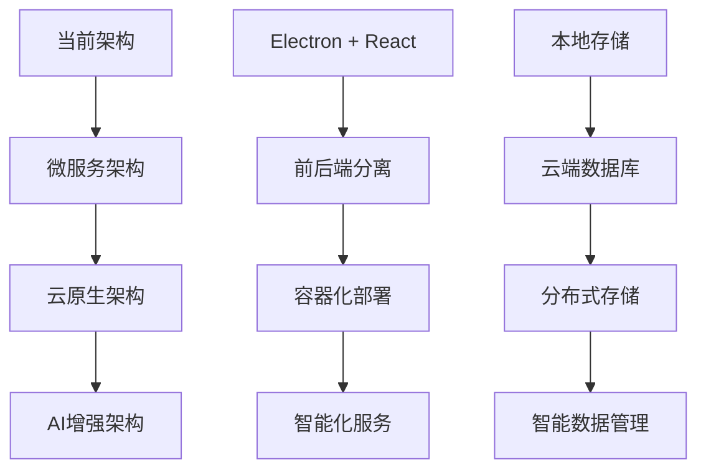

# 🗺️ 项目路线图

> DeskTODOList 的发展规划和未来愿景

## 🎯 项目愿景

打造最优雅、最高效的跨平台待办事项管理应用，让任务管理变得简单而愉悦。

## 📅 发展时间线

### 🚀 第一阶段：核心功能 (已完成 - 2024 年 1 月)

**目标**：建立稳定的 MVP 版本，提供核心任务管理功能

- ✅ **任务管理核心功能**

  - 任务创建、编辑、删除、完成
  - 优先级设置和管理
  - 截止日期设置
  - 任务描述和备注

- ✅ **用户界面**

  - 苹果风格设计语言
  - 浅色/深色主题切换
  - 响应式布局
  - 流畅的动画效果

- ✅ **数据管理（本地优先）**

  - IndexedDB + Dexie 本地数据库
  - 自动备份机制（可选）
  - CSV/JSON 导入导出

- ✅ **基础功能**
  - 快捷键支持
  - 搜索和筛选
  - 系统通知
  - 多语言支持

### 🔄 第二阶段：增强功能 (2024 年 2 月-4 月)

**目标**：提升用户体验，增加高级功能

- 🚧 **云端同步（可选，默认关闭）** (开发中)

  - 多设备数据同步
  - 账户系统集成
  - 冲突解决机制
  - 离线优先策略

- 📋 **高级任务管理**

  - 子任务支持
  - 任务模板系统
  - 重复任务设置
  - 任务依赖关系

- 📊 **数据分析**

  - 详细的统计报表
  - 生产力趋势分析
  - 时间追踪功能
  - 目标设定和追踪

- 🔗 **集成功能**
  - 日历应用集成
  - 邮件客户端集成
  - 第三方服务 API
  - Webhook 支持

### 📱 第三阶段：移动端扩展 (2024 年 5 月-8 月)

**目标**：实现真正的跨平台体验

- 📱 **移动应用开发**

  - iOS 原生应用
  - Android 原生应用
  - 与桌面端数据同步
  - 移动端专属功能

- 🌐 **Web 版本**

  - 渐进式 Web 应用(PWA)
  - 离线功能支持
  - 跨浏览器兼容
  - 响应式设计优化

- 🔄 **同步优化**
  - 实时同步机制
  - 增量同步算法
  - 冲突解决优化
  - 网络状态适配

### 🧩 第四阶段：生态系统 (2024 年 9 月-12 月)

**目标**：构建开放的生态系统，支持扩展和定制

- 🔌 **插件系统**

  - 插件开发框架
  - 插件市场
  - 社区插件支持
  - API 文档完善

- 🤖 **智能功能**

  - AI 任务建议
  - 自然语言处理
  - 智能分类和标签
  - 个性化推荐

- 👥 **协作功能**
  - 团队工作空间
  - 任务分享和协作
  - 评论和讨论
  - 权限管理系统

### 🚀 第五阶段：企业级功能 (2025 年)

**目标**：满足企业用户需求，提供专业解决方案

- 🏢 **企业版功能**

  - 单点登录(SSO)
  - 企业级安全
  - 批量用户管理
  - 审计日志

- 📈 **高级分析**

  - 团队生产力分析
  - 项目进度追踪
  - 资源分配优化
  - 自定义报表

- 🔧 **管理工具**
  - 管理员控制台
  - 策略配置
  - 使用情况监控
  - 技术支持集成

## 🎯 功能优先级

### 🔥 高优先级 (P0)

- 云端同步功能
- 移动端应用
- 性能优化
- 安全性增强

### ⭐ 中优先级 (P1)

- 子任务支持
- 高级筛选
- 数据分析
- 第三方集成

### 💡 低优先级 (P2)

- AI 智能功能
- 插件系统
- 协作功能
- 企业级功能

## 📊 技术路线图

### 🏗️ 架构演进

### 🛠️ 技术栈演进

| 阶段     | 前端技术             | 后端技术          | 数据库            | 部署方式 |
| -------- | -------------------- | ----------------- | ----------------- | -------- |
| 第一阶段 | React + Electron     | 无                | 本地 JSON         | 桌面应用 |
| 第二阶段 | React + Electron     | Node.js + Express | SQLite + Cloud DB | 混合部署 |
| 第三阶段 | React + React Native | Node.js + GraphQL | PostgreSQL        | 云端部署 |
| 第四阶段 | 微前端架构           | 微服务架构        | 分布式数据库      | 容器化   |
| 第五阶段 | AI 增强前端          | AI 服务集成       | 智能数据湖        | 云原生   |

## 🎨 设计演进

### 视觉设计

- **第一阶段**：苹果风格简约设计
- **第二阶段**：自适应设计系统
- **第三阶段**：跨平台一致性设计
- **第四阶段**：个性化主题系统
- **第五阶段**：AI 驱动的智能界面

### 交互设计

- **第一阶段**：基础交互模式
- **第二阶段**：手势和快捷操作
- **第三阶段**：语音和触控优化
- **第四阶段**：智能交互建议
- **第五阶段**：自然语言交互

## 📈 成功指标

### 用户指标

- **月活跃用户数**：目标 100 万+
- **用户留存率**：7 日留存>70%，30 日留存>50%
- **用户满意度**：App Store 评分>4.5 星
- **社区活跃度**：GitHub Stars>10k

### 产品指标

- **功能使用率**：核心功能使用率>80%
- **性能指标**：启动时间<1 秒，操作响应<100ms
- **稳定性**：崩溃率<0.1%
- **安全性**：零重大安全事件

### 商业指标

- **市场份额**：在待办应用市场占有率>5%
- **收入增长**：年收入增长率>100%
- **成本控制**：获客成本<$10
- **盈利能力**：实现可持续盈利

## 🤝 社区参与

### 开源贡献

- 欢迎社区贡献代码和想法
- 定期举办开发者聚会
- 建立贡献者激励机制
- 培养核心维护者团队

### 用户反馈

- 建立用户反馈收集机制
- 定期进行用户调研
- 快速响应用户需求
- 透明的产品决策过程

## 🔄 迭代原则

### 敏捷开发

- 2 周一个迭代周期
- 持续集成和部署
- 快速原型验证
- 数据驱动决策

### 用户中心

- 用户需求优先
- 简洁易用原则
- 性能和稳定性
- 隐私和安全保护

---

## 📞 参与讨论

我们欢迎社区成员参与路线图的讨论和规划：

- 💬 [GitHub Discussions](https://github.com/your-username/DeskTODOList/discussions)
- 📧 Email: roadmap@desktodolist.com
- 🐦 Twitter: [@DeskTODOList](https://twitter.com/DeskTODOList)
- 💬 Discord: [加入我们的社区](https://discord.gg/desktodolist)

---

📅 **最后更新**：2024 年 1 月 15 日  
👥 **维护团队**：DeskTODOList 产品团队  
🔄 **更新频率**：每季度更新一次
